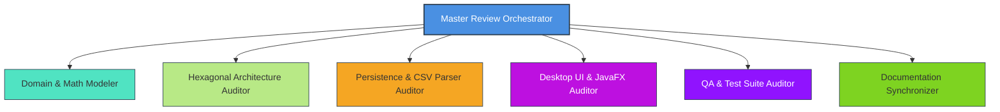

# AGENTS.md - Multi-Agent System Playbook & Review Directives

Welcome to **NEPE (Nexus Exchange Prediction Engine)**. This document serves as the master specification, architectural ground truth, and operational playbook for autonomous and specialized AI agents tasked with inspecting, auditing, verifying, and maintaining this codebase.

---

## 1. System Overview & Core Philosophy

**NEPE** is an analytical desktop platform engineered to estimate true probabilities in association football betting exchange markets (Back/Lay) and identify positive Expected Value ($\text{EV} > 0$) trading opportunities pre-match and in real-time.

### Key Architectural Pillars
* **Human-in-the-Loop:** Total manual CRUD and edit override capabilities across all entities (competitions, teams, matches, live events, manual xG).
* **Pure Hexagonal Architecture (Ports & Adapters):** Strict domain isolation. The domain core is written in pure Java (zero framework dependencies on Spring, JPA/Hibernate, or JavaFX).
* **Feature-by-Package Layout:** Highly cohesive vertical modules (`match`, `competition`, `inference`, `settings`, `shared`, `bootstrap`).
* **Strict Modern Tech Stack:** Java 25 (Virtual Threads, Records, Sealed types, Pattern Matching), Spring Boot 4.x, JavaFX 26.x, MariaDB (HikariCP), JUnit 5, AssertJ.
* **Deterministic Testing:** Zero dynamic mocking libraries (e.g., no Mockito) in domain core unit tests; rely on explicit hand-crafted stubs, fakes, and value objects.

---

## 2. Package Architecture & Dependency Boundaries

Any agent operating in this repository must strictly maintain the directional integrity of the Hexagonal architecture.

```text
org.nepe
├── bootstrap                      # Spring Boot & JavaFX lifecycle glue
│   ├── NepeApplication.java       # Spring Boot main entrypoint
│   ├── JavaFxApplication.java     # JavaFX Application lifecycle coordinator
│   └── SpringFXMLLoader.java      # Spring-aware FXML Controller factory
│
├── shared                         # Cross-cutting primitives & domain exceptions
│   └── exception
│       ├── NepeException.java                 # Base unchecked domain exception
│       ├── DomainValidationException.java     # Business rule & math invariant violation
│       ├── EntityNotFoundException.java       # Missing DB record
│       ├── DataImportException.java           # CSV parsing failure
│       ├── AliasMappingRequiredException.java # Unknown team detected during CSV load
│       ├── LiveTradingException.java          # Invalid live match action
│       └── GuiException.java                  # FXML or desktop view failure
│
├── competition                    # FEATURE: Competitions, Teams & Aliases
│   ├── domain/                    # Competition, Season, Team, TeamAlias
│   ├── port/in/                   # ManageCompetitionUseCase, ManageSeasonUseCase, Commands
│   ├── port/out/                  # CompetitionRepositoryPort, TeamRepositoryPort, etc.
│   ├── service/                   # CompetitionService, SeasonService, TeamService
│   └── adapter/
│       ├── in/                    # CompetitionViewController, AliasMappingController (JavaFX)
│       └── out/                   # SpringData repos, JPA entities, Mappers
│
├── match                          # FEATURE: Fixtures, CRUD, Events & CSV Ingestion
│   ├── domain/                    # Match, MatchEvent, MatchStatistics, MatchModifiers, MarketOdds
│   ├── port/in/                   # ManageMatchUseCase, LiveMatchTradingUseCase, ImportCsvMatchesUseCase
│   ├── port/out/                  # MatchRepositoryPort, MatchEventRepositoryPort, MatchDetailsDTO
│   ├── service/                   # MatchService, LiveMatchTradingService, ImportCsvMatchesService
│   └── adapter/
│       ├── in/                    # DashboardController, LiveConsoleController (JavaFX)
│       └── out/                   # CsvParserAdapter, SpringData repos, JPA entities, Mappers
│
├── inference                      # FEATURE: Pure Mathematical Inference Engine
│   ├── domain/                    # PoissonModel, DixonColesModel, EvCalculator,
│   │                              # LiveEngineModifiers, TeamStrengthCalculator, XgEstimator
│   ├── port/in/                   # CalculatePreMatchInferenceUseCase, CalculateLiveInferenceUseCase
│   ├── service/                   # PreMatchInferenceService, LiveInferenceService
│   └── adapter/in/                # PreMatchAnalysisController (JavaFX)
│
└── settings                       # FEATURE: Global Configuration & Parameters
    ├── domain/                    # AppSettings (commissionRate, defaultNMatches, gamma, greenUpTarget)
    ├── port/in/ & port/out/       # ManageSettingsUseCase, SettingsRepositoryPort
    ├── service/                   # SettingsService
    └── adapter/
        ├── in/                    # SettingsViewController (JavaFX)
        └── out/                   # SettingsRepositoryAdapter, JPA entity, Mapper
```

### Dependency Rules for Reviewers
1. **Domain Purity:** Classes inside `org.nepe.*.domain` MUST NOT import anything from `org.springframework.*`, `jakarta.persistence.*`, `javafx.*`, or any adapter package.
2. **DTO & Port Boundaries:** Controllers in `adapter.in` must communicate with the core strictly through Inbound Ports (`*UseCase`), passing and receiving immutable DTOs or Domain Entities.
3. **Persistence Isolation:** JPA Entities (`*JpaEntity`) and Spring Data Interfaces (`SpringData*Repository`) MUST reside strictly inside `adapter.out`. They must NEVER be returned to UseCases or Controllers.
4. **Exception Translation:** Low-level SQL/JDBC exceptions (such as `DataIntegrityViolationException`) caught in `adapter.out` MUST be translated into domain-specific unchecked exceptions (`NepeException` hierarchy).

---

## 3. Mathematical Models & Business Invariants (Ground Truth)

All mathematical and business logic must precisely match the scientific foundations below.

### 3.1 Expected Goals (xG) Heuristic & Hierarchy
* **Heuristic Formula:**
  $$\text{xG} = (\text{ShotsOnTarget} \times 0.30) + ((\text{TotalShots} - \text{ShotsOnTarget}) \times 0.05)$$
* **Resolution Priority:**
  1. `manual_home_xg` / `manual_away_xg` (if non-null user override).
  2. Estimated xG via shot statistics (`home_shots`, `home_shots_on_target`).
  3. Real goals scored (`home_score`, `away_score`) as fallback when shot data is missing.
  4. Empty / Neutral baseline if no data is available.

### 3.2 Historical Team Strengths ($\alpha_i, \beta_i$) & Sample Selection
* **Sample Selection Algorithm:**
  * If the team has played $M \ge 10$ matches in the current season, analyze **all $M$ matches**.
  * If $M < 10$, fetch the last $10 - M$ matches from the **previous season** to guarantee $N_{\min} = 10$.
* **Recency & Inter-Season Weighting:**
  $$w_k = \frac{\text{count} - i}{\text{count}} \times (\text{isPreviousSeason} \mathbin{?} \gamma : 1.0), \quad \text{default } \gamma = 0.70$$
  $$\bar{\text{xG}}_{\text{scored}, i} = \frac{\sum w_k \cdot \text{xG}_{\text{scored}, k}}{\sum w_k}, \quad \alpha_i = \frac{\bar{\text{xG}}_{\text{scored}, i}}{\bar{\text{xG}}_{\text{league}}}, \quad \beta_i = \frac{\bar{\text{xG}}_{\text{conceded}, i}}{\bar{\text{xG}}_{\text{league}}}$$
* **Pre-Match Expected Goal Rates ($\lambda_{\text{Home}}, \mu_{\text{Away}}$):**
  $$\lambda_{\text{Home}} = \alpha_{\text{Home}} \times \beta_{\text{Away}} \times \bar{\text{xG}}_{\text{league}} \times \text{EffectiveHomeAdvantage} \times \text{mod}_{\text{att,H}} \times \text{mod}_{\text{def,A}}$$
  $$\mu_{\text{Away}} = \alpha_{\text{Away}} \times \beta_{\text{Home}} \times \bar{\text{xG}}_{\text{league}} \times \frac{1}{\text{EffectiveHomeAdvantage}} \times \text{mod}_{\text{att,A}} \times \text{mod}_{\text{def,H}}$$
  * $\text{EffectiveHomeAdvantage} = 1.00$ if `is_neutral_venue == true`, else $\text{HomeAdvantage}$ (default $1.20$).
  * If `isMutualLowUrgency() == true`, apply factor $0.65$ to both $\lambda$ and $\mu$.

### 3.3 Dixon-Coles (1997) Correction
* Standard independent Poisson joint probability: $P(X=x, Y=y) = \text{Pois}(x; \lambda) \times \text{Pois}(y; \mu)$.
* Low-score correction factor $\tau(x, y)$:
  $$\tau(0,0) = 1 - \lambda \mu \rho, \quad \tau(1,0) = 1 + \mu \rho, \quad \tau(0,1) = 1 + \lambda \rho, \quad \tau(1,1) = 1 - \rho, \quad \tau(x,y) = 1 \text{ otherwise}$$
* $\rho \in (-1.0, 1.0)$, stored in `competitions.dixon_coles_rho` (default $-0.1200$).
* Matrix must be renormalized over the $10 \times 10$ score grid ($0 \le x, y \le 9$) so $\sum P(x,y) = 1.0$.

### 3.4 Expected Value (EV) & Exchange Trading
* **Back (Punta) EV:**
  $$\text{EV}_{\text{Back}} = P \times (K_{\text{Back}} - 1) \times (1 - \text{comm}) - (1 - P)$$
* **Lay (Banca) EV:**
  $$\text{EV}_{\text{Lay}} = (1 - P) \times (1 - \text{comm}) - P \times (K_{\text{Lay}} - 1)$$
* **Risk-Adjusted Lay EV (ROI on Liability):**
  $$\text{EV}_{\text{Lay, Risk}} = \frac{\text{EV}_{\text{Lay}}}{K_{\text{Lay}} - 1}$$

### 3.5 Live Match Dynamic Modifiers
* **Time-Decay:** $\text{factor} = \max\left(0.0, \frac{90 - t}{90}\right)$. For $t \ge 90$, residual rates clamp immediately to $0.0$.
* **Red Cards:** For each red card $C_{\text{team}}$, team rate is multiplied by $0.70^{C}$, opponent rate by $1.30^{C}$.
* **Second-Half Must-Win Motivation:** If $t \ge 45$ and a team has `must_win == true` while drawing or trailing:
  * Team offensive rate $\lambda \times 1.25$
  * Team defensive vulnerability (opponent rate) $\mu \times 1.20$

### 3.6 Data Integrity & Overwrite Protection
* **Upsert Key:** Composite business key `(home_team_id, away_team_id, match_date_time)`.
* **Overwrite Protection:** If `is_manually_edited == 1`, CSV re-import MUST NOT overwrite scores, shots, cards, manual xG, or modifiers; only missing reference odds may be backfilled.
* **Timezones:** All timestamps stored in **UTC** in DB and converted to user local timezone (**Europe/Rome / CET/CEST**) in the UI.

---

## 4. Specialized Reviewer Personas & Audit Scope

When executing review workflows, spawn or assume the following specialized agent roles:



### Persona 1: Domain & Mathematical Modeler (`inference.domain`)
* **Primary Target:** `org.nepe.inference.domain.*`, `docs/theoretical_foundations.md`
* **Audit Checklist:**
  - [ ] Numerical stability (no division by zero in odds $\le 1.0$, lambda $\le 0$, sum weights $= 0$).
  - [ ] Exact Dixon-Coles $\tau(x,y)$ implementation and normalization across $10 \times 10$ matrix.
  - [ ] Linear time-decay clamping at $t \ge 90$.
  - [ ] Red card compound power scaling ($0.70^C$ and $1.30^C$).
  - [ ] Second-half ($t \ge 45$) Must-Win motivation triggers only when tied or trailing.
  - [ ] Value record immutability (`EvEvaluation`, `LiveRates`, `TeamStrength`, `PreMatchRates`).

### Persona 2: Hexagonal & SOLID Architecture Auditor
* **Primary Target:** Entire `src/main/java/org/nepe/**` hierarchy, `docs/architectural_design.md`
* **Audit Checklist:**
  - [ ] Zero illegal imports in `domain` packages (`org.springframework`, `jakarta.persistence`, `javafx`).
  - [ ] Zero inline domain/mathematical calculations in Inbound/Outbound Adapters (e.g., probability math, time decay, EV formulas, scoring heuristics must NEVER be calculated directly in JavaFX controllers, but must delegate to domain services/models or dedicated use cases; if missing, create appropriate domain ports/services).
  - [ ] Clean Inbound/Outbound port contracts; no leakage of JPA entities or UI nodes into domain.
  - [ ] Absence of inappropriate hardcoded values or magic numbers in controllers/adapters (parameters like commission rates, sample sizes, and decay factors must be dynamically retrieved or read from settings/competition entities).
  - [ ] Exception translation pattern enforced in all Outbound Adapters.
  - [ ] Single Responsibility and DRY adherence without over-engineering.

### Persona 3: Persistence & CSV Data Ingestion Auditor
* **Primary Target:** `org.nepe.match.adapter.out.*`, `org.nepe.competition.adapter.out.*`, `schema.sql`, `data.sql`, `docs/database_design.md`
* **Audit Checklist:**
  - [ ] 3NF schema adherence and presence of covering indexes (`idx_matches_home_lookup`, `idx_matches_away_lookup`, `idx_matches_competition`).
  - [ ] Idempotent CSV parsing supporting 2-digit and 4-digit years (`dd/MM/yy` vs `dd/MM/yyyy`).
  - [ ] Missing time fallback to 12:00:00 UTC.
  - [ ] `is_manually_edited` overwrite protection logic strictly honored on re-import.
  - [ ] Transaction demarcation (`@Transactional`) on multi-table operations (e.g., live events + match stats update).

### Persona 4: Desktop UI, JavaFX & Spring Integration Auditor
* **Primary Target:** `org.nepe.*.adapter.in.*`, `org.nepe.bootstrap.*`, `src/main/resources/views/*.fxml`, `docs/gui_design.md`
* **Audit Checklist:**
  - [ ] Controller factory configuration in `SpringFXMLLoader` for full Spring Bean injection.
  - [ ] JavaFX Application Thread safety (heavy operations dispatched asynchronously, UI mutated on UI thread).
  - [ ] Modal dialog handling (`AliasMappingController`, `FileChooser`).
  - [ ] UTC to CET/CEST date-time formatting in tables.
  - [ ] Synthetic EV+ badge rendering logic on Dashboard.

### Persona 5: QA, Test Suite & Edge-Case Auditor
* **Primary Target:** `src/test/java/**`, `docs/testing_strategy.md`
* **Audit Checklist:**
  - [ ] Strict absence of Mockito / byte-buddy dynamic mocking in Domain Core tests.
  - [ ] Coverage $> 95\%$ on `inference.domain` and `match.domain`.
  - [ ] Edge cases tested: $\lambda=0$, $t=90, 95$, zero odds, negative scores, duplicate team aliases, corrupt CSV rows.
  - [ ] All tests passing deterministically via `./mvnw test`.

### Persona 6: Documentation & Code Parity Synchronizer
* **Primary Target:** `docs/*.md`, `README.md`, codebase symbols
* **Audit Checklist:**
  - [ ] Method names, formula constants, and class references in `docs/` match actual Java code.
  - [ ] SQL DDL in `docs/database_design.md` matches `schema.sql` and JPA annotations.
  - [ ] FXML view references in `docs/gui_design.md` match actual `.fxml` files in `src/main/resources/views/`.

---

## 5. Standard Review Workflow & CLI Commands

When conducting a project verification pass, follow this exact sequence:

```bash
# Step 1: Clean build and compile verification
./mvnw clean test-compile

# Step 2: Full deterministic test suite execution
./mvnw test

# Step 3: Run specific domain unit test suites
./mvnw test -Dtest=PoissonModelTest,DixonColesModelTest,EvCalculatorTest,LiveEngineModifiersTest

# Step 4: Verify domain architectural isolation (Zero framework imports in domain)
# Expected result: NO output (exit code 0)
grep -rn "import org.springframework" src/main/java/org/nepe/*/domain/
grep -rn "import jakarta.persistence" src/main/java/org/nepe/*/domain/
grep -rn "import javafx" src/main/java/org/nepe/*/domain/
```

---

## 6. Finding Severity & Reporting Taxonomy

All agents filing issues or review notes must use the following standardized structure:

```markdown
### [SEVERITY_LEVEL] Finding Title

* **Location:** `package.ClassName` (or `docs/filename.md:L123-145`)
* **Category:** [Mathematical Accuracy | Architectural Violation | Persistence/Concurrency | UI Thread Safety | Testing Gap | Documentation Discrepancy]
* **Description:** Clear explanation of what is wrong or inconsistent.
* **Root Cause / Theoretical Justification:** Why this violates the domain rules, mathematical theorems, or architectural guidelines.
* **Recommended Remediation:** Concrete code diff or architectural fix.
```

### Severity Levels:
* **BLOCKER:** Test failure, mathematical formula error leading to incorrect EV/probability, database corruption, or fatal application crash.
* **CRITICAL:** Architectural violation (e.g., framework leak into domain core), race condition, or broken overwrite protection.
* **MAJOR:** Missing edge-case handling, UI freeze under load, missing index, or doc-code contradiction.
* **MINOR:** Sub-optimal performance, naming inconsistency, missing invariant validation error message.
* **IMPROVEMENT:** Code readability enhancement, additional test scenario, or doc phrasing refinement.

---

## 7. Master Protocol: Clean-Context Comprehensive System Audit

When an autonomous AI agent is spawned in a **clean context** to perform a total system verification pass of NEPE, it MUST adhere to the following operational protocol.

### 7.1 Objective & Strict Severity Filtering Policy
* **Current Operational Baseline:** The software is currently functionally operative with all 18 known tickets resolved and 476/476 tests passing.
* **Strict Severity Threshold:** **Focus exclusively on detecting BLOCKER, CRITICAL, and MAJOR defects.**
* **Filtering Directive:** Do NOT file `MINOR` cosmetic suggestions, stylistic refactorings, or trivial `IMPROVEMENT` notes (improvements are always theoretically possible in any mature software). The objective of the clean-context audit is to identify genuine defects, architectural leaks, or calculation flaws that threaten correctness, reliability, or maintainability.

### 7.2 The Five Core Inspection Vectors

#### Vector 1: Hexagonal Purity & Inline Calculation Ban
* **The Invariant:** Inbound Adapters (JavaFX Controllers in `org.nepe.*.adapter.in.*`) and Outbound Adapters (Repositories/Parsers in `org.nepe.*.adapter.out.*`) MUST NOT perform inline mathematical computations, domain aggregations, or business heuristics.
* **What to Inspect:**
  - Check controllers for inline probability math, Poisson calculations, Dixon-Coles adjustments, time-decay scalers, red card multipliers, or EV/Green-Up ratio formulas.
  - All mathematical and trading evaluations MUST delegate strictly to Domain models/services (`EvCalculator`, `PoissonModel`, `DixonColesModel`, `LiveEngineModifiers`, `TeamStrengthCalculator`, `XgEstimator`) or Inbound Ports (`*UseCase`).
  - If a controller performs calculations because a domain method or port is missing, the agent MUST flag this as an architectural violation and design the appropriate Inbound Port/Domain Service rather than keeping inline math in the UI.

#### Vector 2: Hard-Coded Values & Magic Numbers Audit
* **The Invariant:** Domain parameters, business thresholds, statistical baselines, and database credentials must never be hardcoded in application logic or controllers.
* **What to Inspect:**
  - Verify that exchange commission rates, historical sample sizes ($N$), and inter-season decay factors ($\gamma$) are dynamically retrieved via `AppSettings` / `ManageSettingsUseCase` or user input, never hardcoded in service implementations.
  - Verify that league parameters (such as Dixon-Coles $\rho$ or `home_advantage`) are dynamically loaded from the `Competition` database entity, using fallback defaults only when DB attributes are explicitly null.
  - Ensure any mathematical fallbacks in Domain Core (`DEFAULT_LEAGUE_AVG_XG = 1.35`, `DEFAULT_HOME_ADVANTAGE = 1.20`, `DEFAULT_RHO = -0.1200`) are explicitly declared as named constants within domain classes, never scattered as raw literals.

#### Vector 3: Runtime Stability, Concurrency & UI Thread Safety
* **What to Inspect:**
  - Verify that heavy asynchronous operations (such as pre-match inference evaluation across schedules or CSV parsing) run on Virtual Threads (`Thread.startVirtualThread`), and that all mutations to JavaFX Scene Graph controls are strictly wrapped in `Platform.runLater(...)`.
  - Verify that all modal dialogs (`Alert`) invoke `initOwner(getWindow())` anchored to an active stage window to avoid modal detachment and focus traps on macOS / Linux.
  - Verify null-safety on all optional statistical fields (scores, shots, red cards, odds) to eliminate any risk of unhandled `NullPointerException`.

#### Vector 4: Data Layer, Overwrite Protection & Timezones
* **What to Inspect:**
  - Verify that the CSV re-import pipeline (`ImportCsvMatchesService`) strictly enforces the `is_manually_edited == true` overwrite protection barrier: scores, statistics, manual xG, and modifiers must never be overwritten on existing matches; only missing reference odds may be backfilled.
  - Verify timestamp normalization: all timestamps must be stored in UTC (`Instant` / `DATETIME`) and presented in the local timezone (`Europe/Rome` / CET/CEST).
  - Verify cascading rules: deleting a team or competition must cascade properly (`team_aliases`, `competition_teams`), while active fixtures in `matches` must enforce referential integrity.

#### Vector 5: Compilation & Test Determinism
* **What to Inspect:**
  - The entire project must compile cleanly with `./mvnw clean test-compile`.
  - The complete automated test suite (`./mvnw test`) must pass deterministically (0 failures, 0 errors, 0 skipped).
  - Verify that the Domain Core unit tests (`src/test/java/org/nepe/*/domain/*`) contain **zero Mockito / ByteBuddy dynamic mocking dependencies**, relying exclusively on hand-crafted stubs, fakes, and value objects.

### 7.3 Standard CLI Audit Command Sequence

The clean-context agent should execute the following verification commands:

```bash
# Step 1: Clean build and compile verification
./mvnw clean test-compile

# Step 2: Full deterministic test suite execution
./mvnw test

# Step 3: Verify strict domain isolation (Zero framework imports in domain core)
grep -rn "import org.springframework" src/main/java/org/nepe/*/domain/
grep -rn "import jakarta.persistence" src/main/java/org/nepe/*/domain/
grep -rn "import javafx" src/main/java/org/nepe/*/domain/

# Step 4: Scan adapters for potential inline mathematical or logic leaks
grep -rn "Math\." src/main/java/org/nepe/*/adapter/
grep -rn "new Alert" src/main/java/org/nepe/*/adapter/

# Step 5: Check for unhandled exceptions or empty catch blocks
grep -rn "catch.*{}" src/main/java/org/nepe/
```

