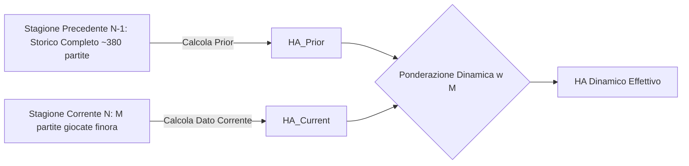

# Progettazione Tecnica: Home Advantage Dinamico per Competizione - NEPE

**Stato Documento:** Proposta di Architettura & Specifiche Future (RFC)  
**Modulo Impattato:** `org.nepe.inference`, `org.nepe.competition`, `org.nepe.match`, Database Schema  
**Obiettivo:** Estendere il calcolo del Vantaggio Casalingo (Home Advantage - $\text{HA}$) da costante fissa globale ($1.20$) a parametro quantitativo dinamico, stimato a runtime su base campionaria multi-stagione per ciascuna competizione.

---

## 1. Motivazione Scientifica ed Econometrica

Nel modello di previsione calcistica di Poisson e Dixon-Coles, il fattore **Home Advantage ($\text{HA}$)** quantifica la superiorità statistica media delle squadre che giocano nel proprio stadio rispetto alla trasferta.

### 1.1 Limiti dell'Approccio Statico Globale
Attualmente, NEPE adotta la costante di letteratura $\text{HA} = 1.20$ (+20% sui gol attesi in casa, $\frac{1}{1.20} \approx 0.833$ in trasferta). Sebbene $1.20$ sia un ottimo stimatore medio *off-the-shelf* per i massimi campionati europei, la letteratura econometrica sul calcio dimostra che:
1. **Eterogeneità tra Leghe:** L'Home Advantage varia sensibilmente tra campionati (es. Premier League $\approx 1.16 - 1.18$, Serie A $\approx 1.20 - 1.22$, campionati sudamericani o leghe con forti dislivelli climatici/altimetrici $\ge 1.30$).
2. **Trend Storico Decrescente:** Nel calcio moderno (tattiche a baricentro alto, qualità dei manti erbosi, assenza di pubblico in determinate circostanze), il fattore campo ha mostrato una progressiva contrazione nel tempo.
3. **Fluttuazioni Intra-Stagionali:** All'inizio della stagione il dato storico dell'annata precedente è il miglior predittore, ma man mano che la stagione avanza le caratteristiche specifiche del torneo in corso devono assumere un peso crescente.

---

## 2. Modello Matematico e Algoritmo di Calcolo

### 2.1 Definizione Empirica di Base
Per una specifica competizione e stagione, l'Home Advantage grezzo calcolato sugli Expected Goals ($\text{xG}$) è definito come:

$$\text{HA}_{\text{grezzo}} = \frac{\bar{\text{xG}}_{\text{Home}}}{\bar{\text{xG}}_{\text{Away}}} = \frac{\sum_{k \in \text{Matches}} \text{xG}_{\text{Home}, k}}{\sum_{k \in \text{Matches}} \text{xG}_{\text{Away}, k}}$$

$$\text{Away Disadvantage} = \frac{1}{\text{HA}_{\text{grezzo}}}$$

* In caso di partita in campo neutro (`is_neutral_venue == true`), l'Inference Engine impone $\text{EffectiveHomeAdvantage} = 1.00$.

---

### 2.2 Algoritmo di Aggiornamento Progressivo Multi-Stagione (Shrinkage Bayesiano)

Per evitare problemi di **overfitting** o varianza eccessiva nelle prime giornate di campionato (quando $M < 30$ partite complessive nel torneo), il sistema adotta un modello di interpolazione ponderata (Empirical Bayes Shrinkage):



#### Formula di Combinazione Convexa:
$$\text{HA}_{\text{effettivo}}(M) = (1 - w(M)) \cdot \text{HA}_{\text{prior}} + w(M) \cdot \text{HA}_{\text{current}}(M)$$

Dove:
* $\text{HA}_{\text{prior}}$: Vantaggio casalingo calcolato sull'intera stagione precedente (oppure costante di default $1.20$ se non vi sono dati storici precedenti).
* $\text{HA}_{\text{current}}(M)$: Vantaggio casalingo calcolato sulle $M$ partite già terminate nella stagione corrente.
* $w(M) \in [0.0, 1.0]$: Fattore di peso dinamico proporzionale alla numerosità campionaria:
  $$w(M) = \frac{M}{M + M_0}$$
  con $M_0 = 40$ (costante di inerzia statistica).

#### Comportamento della Curva $w(M)$:
* **Inizio Campionato ($M = 0$ partite):** $w(0) = 0 \implies \text{HA} = \text{HA}_{\text{prior}}$ (il modello usa al 100% il dato consolidato della stagione scorsa).
* **Dopo 40 partite ($M = 40$, circa 4 giornate di Serie A):** $w(40) = 0.50 \implies$ peso paritetico 50% prior e 50% stagione corrente.
* **A metà campionato ($M \approx 190$ partite):** $w(190) \approx 0.826 \implies$ il dato della stagione corrente domina all'83%.
* **A fine stagione ($M \approx 380$ partite):** $w(380) \approx 0.905 \implies$ il modello è quasi interamente allineato alla stagione corrente.

#### Clamping di Sicurezza (Invarianti di Business):
Per prevenire anomalie su leghe con pochi match, il valore finale viene delimitato nell'intervallo fisso:
$$\text{HA}_{\text{effettivo}} \in [1.00, 1.60]$$

---

## 3. Impatto sullo Schema del Database & Persistenza

Seguendo il principio **Human-in-the-Loop** e le regole 3NF del progetto, l'implementazione prevede due modalità di persistenza:

### 3.1 Estensione Tabella `competitions`
Aggiunta del campo di configurazione manuale e calibrazione:
```sql
ALTER TABLE competitions 
ADD COLUMN home_advantage DECIMAL(4,2) NULL DEFAULT 1.20;
```
* **Valore non-null:** Se l'utente specifica un valore manuale a schermo (es. $1.25$), il sistema rispetta l'override utente.
* **Valore null / 'Auto':** Se impostato su modalità automatica, il sistema calcola il valore a runtime tramite la formula di shrinkage descritta al punto 2.2.

---

## 4. Design dei Moduli & Confini Architetturali (Hexagonal Architecture)

```text
Feature Interaction:
[ competition.domain.Competition ] ───► homeAdvantage (Config / Manual Override)
[ match.service.MatchService ] ───────► getDynamicHomeAdvantage(competitionId, seasonId)
[ inference.service.* ] ──────────────► injects dynamic HA into PreMatchRates / LiveRates
```

### 4.1 Inbound Port & Service (`match` / `inference`)
Aggiunta del metodo di calcolo nel contratto `ManageMatchUseCase`:
```java
double getDynamicHomeAdvantage(int competitionId, int seasonId);
```

Implementazione in `MatchService.java`:
```java
@Override
@Transactional(readOnly = true)
public double getDynamicHomeAdvantage(int competitionId, int seasonId) {
    Optional<Competition> compOpt = competitionRepositoryPort.findById(competitionId);
    if (compOpt.isPresent() && compOpt.get().hasManualHomeAdvantage()) {
        return compOpt.get().getHomeAdvantage(); // Override manuale utente
    }

    // 1. Calcola HA corrente sulle partite terminate della stagione attiva
    List<Match> currentSeasonMatches = matchRepositoryPort.findFinishedMatchesByCompetitionAndSeason(competitionId, seasonId);
    double currentHa = calculateRawHomeAdvantage(currentSeasonMatches);

    // 2. Calcola HA prior sulla stagione precedente
    double priorHa = TeamStrengthCalculator.DEFAULT_HOME_ADVANTAGE; // 1.20 fallback
    Optional<Season> seasonOpt = seasonRepositoryPort.findById(seasonId);
    if (seasonOpt.isPresent()) {
        String prevSeasonName = seasonOpt.get().previous().getName();
        Optional<Season> prevSeasonOpt = seasonRepositoryPort.findByName(prevSeasonName);
        if (prevSeasonOpt.isPresent()) {
            List<Match> prevMatches = matchRepositoryPort.findFinishedMatchesByCompetitionAndSeason(competitionId, prevSeasonOpt.get().getId());
            if (!prevMatches.isEmpty()) {
                priorHa = calculateRawHomeAdvantage(prevMatches);
            }
        }
    }

    // 3. Applica shrinkage empirico
    int m = currentSeasonMatches.size();
    double weight = (double) m / (m + 40);
    double dynamicHa = ((1.0 - weight) * priorHa) + (weight * currentHa);

    return Math.max(1.00, Math.min(1.60, dynamicHa));
}
```

---

## 5. Impatto sull'Interfaccia Utente (JavaFX GUI)

1. **Gestione Anagrafiche (`competition_manager.fxml` / `CompetitionViewController`):**
   * Aggiunta del campo `txtCompHomeAdv` (con checkbox *"Calcolo Automatico a Runtime"*).
2. **Analisi Pre-Match (`pre_match_analysis.fxml` / `PreMatchAnalysisController`):**
   * Visualizzazione nell'header del match del valore effettivo calcolato: `Fattore Campo: x1.19 (Dinamico)`.
   * Checkbox `chkNeutralVenue` che se selezionata sovrascrive istantaneamente $\text{HA} = 1.00$.

---

## 6. Strategia di Testing & Casi Limite

La suite di test `TeamStrengthCalculatorTest` e `MatchServiceTest` dovrà verificare:
1. **Campione Vuoto ($M = 0$):** Ritorno esatto del $\text{HA}_{\text{prior}}$ della stagione precedente.
2. **Nessuna Stagione Precedente Disponibile:** Fallback a $1.20$.
3. **Campionato Anomalo con Più Gol in Trasferta ($\text{xG}_{\text{Home}} < \text{xG}_{\text{Away}}$):** Rispetto del clamp inferiore $\ge 1.00$ (nessuna inversione distorsiva di campo neutro).
4. **Campo Neutro:** Verifica che `isNeutralVenue == true` forzi $1.00$ indipendentemente dall'$\text{HA}$ dinamico calcolato.
