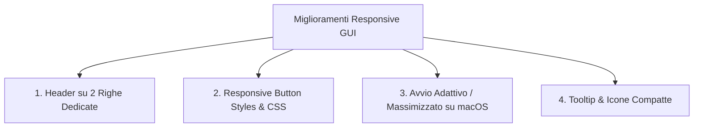

# Progettazione Tecnica: Ottimizzazione Responsive della GUI & Supporto Schermi Compatti (13" / HiDPI) - NEPE

**Stato Documento:** Proposta di Architettura GUI & Miglioramenti Futuri (RFC)  
**Modulo Impattato:** `org.nepe.bootstrap`, `org.nepe.match.adapter.in`, `src/main/resources/views/`, `styles.css`  
**Obiettivo:** Ottimizzare il layout desktop JavaFX per garantire la massima leggibilità e usabilità anche su display compatti (laptop 13", risoluzioni logiche 1280x800 / 1440x900 con scaling Retina su macOS) prevenendo il troncamento del testo dei pulsanti.

---

## 1. Analisi del Problema e Display Density

### 1.1 Risoluzione Logica su Display Retina (macOS)
I display da 13" dei laptop moderni (es. MacBook Pro / MacBook Air) operano con uno scaling HiDPI 2x, offrendo una risoluzione logica effettiva di:
* **1280 × 800 pt** (impostazione di default / standard)
* **1440 × 900 pt** (impostazione "Più spazio")

Detratte la Dock di macOS, la Menu Bar superiore e la barra del titolo della finestra, lo spazio utile effettivo è di circa **1280 × 740 pt**.

### 1.2 Causa del Troncamento del Testo (Text Truncation)
Nel layout originario di `dashboard.fxml`:
* La **Sidebar fissa** occupa `220px`.
* Il padding e i margini del pannello centrale occupano `40px`.
* L'**Header Bar superiore** (`HBox`) colloca in un'unica riga orizzontale continua:
  1. *Selezione Campionato* (Label + ComboBox): ~260px
  2. *Selezione Stagione* (Label + ComboBox): ~190px
  3. *Filtri Stato Match* (4 bottoni: Tutte, Programmate, Live, Terminate): ~310px
  4. *Spaziatore elastico* (`Region HBox.hgrow="ALWAYS"`): ~50px
  5. *Pulsanti Azione* (📂 Importa CSV, ➕ Aggiungi Match, 🔄 Aggiorna): ~370px

**Larghezza minima richiesta senza compressione:** $\approx 1450\text{px} - 1500\text{px}$.  
Poiché l'area centrale su schermi da 13" dispone di soli **1020px - 1060px**, JavaFX comprime forzatamente i bottoni al di sotto del loro `prefWidth`, causando l'inserimento dell'ellissi (`"Program..."`, `"Import..."`, `"Aggiun..."`).

---

## 2. Soluzioni Architetturali & Riprogettazione del Layout



---

### 2.1 Ristrutturazione della Dashboard: Header a Due Righe (`VBox` + 2 `HBox`)

La soluzione più pulita ed ergonomica consiste nel separare l'area di **Filtro & Selezione** dall'area di **Azione Globale**.

#### Nuovo Layout XML (`src/main/resources/views/dashboard.fxml`):
```xml
<!-- Top Controls Container (VBox a due righe) -->
<VBox spacing="10.0" styleClass="header-card">
    <padding>
        <Insets top="12.0" right="16.0" bottom="12.0" left="16.0"/>
    </padding>

    <!-- Riga 1: Filtri di Contesto e Stato -->
    <HBox spacing="12.0" alignment="CENTER_LEFT">
        <Label text="Competizione:" styleClass="section-header"/>
        <ComboBox fx:id="comboCompetition" prefWidth="180.0" promptText="Seleziona Campionato..."/>

        <Label text="Stagione:" styleClass="section-header"/>
        <ComboBox fx:id="comboSeason" prefWidth="130.0" promptText="Stagione..."/>

        <Separator orientation="VERTICAL"/>

        <!-- Match State Filter Buttons -->
        <HBox spacing="6.0" alignment="CENTER_LEFT">
            <Button fx:id="btnFilterAll" text="Tutte" styleClass="button, btn-primary" onAction="#handleFilterAll"/>
            <Button fx:id="btnFilterScheduled" text="Programmate" styleClass="button" onAction="#handleFilterScheduled"/>
            <Button fx:id="btnFilterLive" text="Live" styleClass="button" onAction="#handleFilterLive"/>
            <Button fx:id="btnFilterFinished" text="Terminate" styleClass="button" onAction="#handleFilterFinished"/>
        </HBox>
    </HBox>

    <!-- Riga 2: Azioni Rapide & Riepilogo Conteggio -->
    <HBox spacing="10.0" alignment="CENTER_LEFT">
        <Label fx:id="lblSummary" text="Partite caricate: 0" styleClass="label-muted"/>
        
        <Region HBox.hgrow="ALWAYS"/>

        <!-- Action Buttons -->
        <Button fx:id="btnImportCsv" text="📂 Importa CSV" styleClass="button, btn-primary" onAction="#handleImportCsv"/>
        <Button fx:id="btnAddMatch" text="➕ Aggiungi Match" styleClass="button" onAction="#handleAddMatch"/>
        <Button fx:id="btnRefresh" text="🔄 Aggiorna" styleClass="button" onAction="#handleRefresh"/>
    </HBox>
</VBox>
```

#### Vantaggi del Layout a 2 Righe:
* **Larghezza minima per riga:** $\approx 780\text{px}$, ampiamente compatibile con qualsiasi display da 13", 11" o monitor secondario standard.
* **Nessun troncamento:** Tutti i testi dei bottoni (*"Programmate"*, *"Terminate"*, *"Aggiungi Match"*) restano integralmente leggibili.
* **Impatto verticale minimo:** L'aggiunta della seconda riga richiede solo $\approx 35\text{px}$ verticali.

---

### 2.2 Avvio Adattivo e Massimizzato del Primary Stage (`JavaFxApplication`)

Nel file `JavaFxApplication.java`, l'avvio della finestra su display compatti può essere impostato automaticamente sulle dimensioni visibili dello schermo:

```java
@Override
public void start(Stage primaryStage) {
    // ... configurazione context e scene ...
    
    // Rileva lo spazio visibile effettivo (escludendo Dock e Menu Bar)
    Rectangle2D visualBounds = Screen.getPrimary().getVisualBounds();
    
    primaryStage.setX(visualBounds.getMinX());
    primaryStage.setY(visualBounds.getMinY());
    primaryStage.setWidth(Math.min(1360.0, visualBounds.getWidth()));
    primaryStage.setHeight(Math.min(840.0, visualBounds.getHeight()));
    
    // Su display <= 1440px di larghezza, massimizza automaticamente la finestra
    if (visualBounds.getWidth() <= 1440.0) {
        primaryStage.setMaximized(true);
    }
    
    primaryStage.show();
}
```

---

### 2.3 Regole CSS Responsive (`styles.css`)

Per garantire compattezza grafica ed evitare che JavaFX rimpicciolisca i pulsanti sotto il testo:

```css
/* Protezione dal troncamento e padding compatto per laptop */
.button {
    -fx-min-width: -fx-pref-width; /* Impedisce il taglio con ellissi (...) */
    -fx-padding: 6 11 6 11;
    -fx-font-size: 12px;
}

/* Pulsanti compatti all'interno delle tabelle e dei filtri */
.btn-sm {
    -fx-padding: 3 7 3 7;
    -fx-font-size: 11px;
}

/* Sidebar adattiva */
.sidebar {
    -fx-pref-width: 200px;
    -fx-min-width: 180px;
    -fx-padding: 16 10 16 10;
}
```

---

### 2.4 Introduzione di Tooltip Nativi

Tutti i bottoni con icone o etichette sintetiche devono integrare un elemento `<tooltip>` nativo di JavaFX per massima accessibilità:

```xml
<Button fx:id="btnImportCsv" text="📂 Importa CSV" styleClass="button, btn-primary" onAction="#handleImportCsv">
    <tooltip>
        <Tooltip text="Importa file CSV da Football-Data (supporta multi-stagione)"/>
    </tooltip>
</Button>
```

---

## 3. Piano di Implementazione & Checklist di Collaudo

| Task | Componente | Descrizione |
| :--- | :--- | :--- |
| **1. Refactor Header** | `dashboard.fxml` | Suddivisione della testata orizzontale in 2 righe `HBox` nidificate in un `VBox`. |
| **2. CSS Tuning** | `styles.css` | Aggiunta di `-fx-min-width: -fx-pref-width;` e calibrazione padding/font. |
| **3. Stage Sizing** | `JavaFxApplication.java` | Rilevamento `Screen.getPrimary().getVisualBounds()` e massimizzazione su laptop. |
| **4. Testing Risoluzioni** | Test Visivi | Verifica layout a $1024\times 768$, $1280\times 800$, $1440\times 900$ e $1920\times 1080$. |
